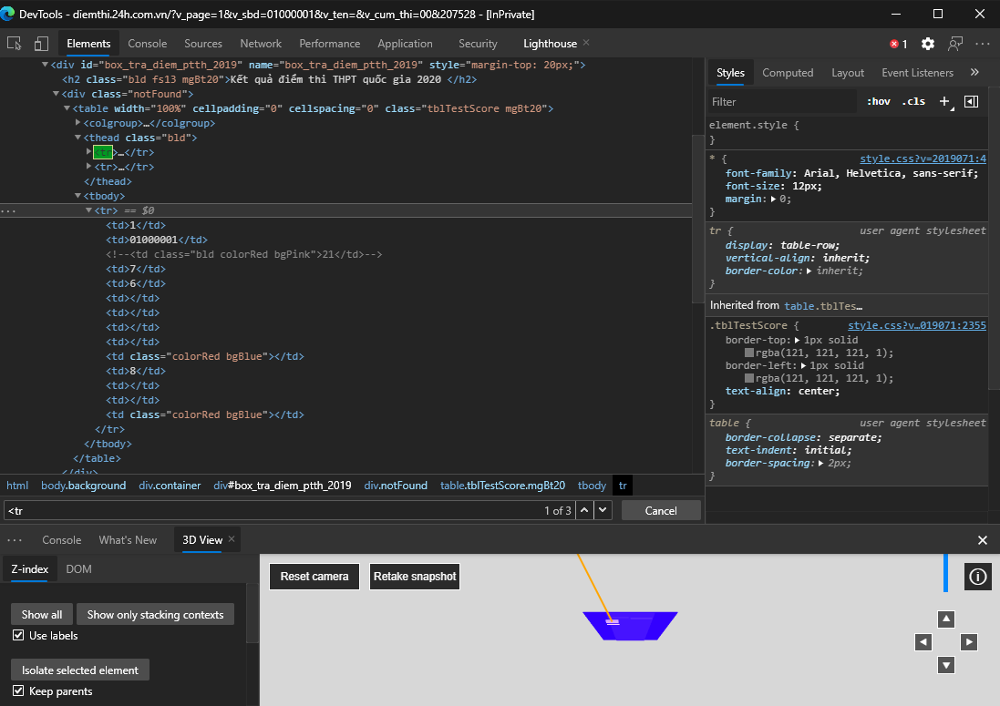

Scraping là gì?
-----------------

<p style='text-align: justify;'>Scraping đơn giản là trích xuất thông tin từ một hệ thống, cơ sở dữ liệu hoặc trang web... nào đó. Khác với crawling, scraping không thu thập toàn bộ thông tin mà chỉ thu thập những thông tin phù hợp với mục đích của người lập trình. Trong quá trình scrap, chúng ta vừa cần thu thập dữ liệu, vừa trích xuất dữ liệu (data extraction) để loại bỏ các thành phần không cần thiết và chỉ để lại dữ liệu đã làm sạch phù hợp với mục đích.</p>

Trước khi bắt đầu scrap
-----------------

<p style='text-align: justify;'>Chúng ta cần quan tâm trang web có bật cơ chế chặn bot hay không. Nếu có chúng ta cần có các biện pháp đối phó đối với từng cơ chế phát hiện:</p>

- Quá nhiều request từ cùng một IP => sử dụng các IP rotator cho mỗi request (Ex: StormProxies...)
- Phát hiện không hỗ trợ JS => sử dụng các headless browser (trình duyệt không có giao diện người dùng) như Selenium, Puppeteer...
- Cloudflare, sử dụng cookie, captcha để chặn bot: cái này mình chịu :<

Bắt đầu thôi
-----------------

<p style='text-align: justify;'>Để demo, mình sẽ scrap dữ liệu từ trang web tra cứu điểm thi của báo điện tử 24h. Có thể dùng các công cụ như Jupyter Notebook hoặc Google Colab để chạy demo này.</p>

<p style='text-align: justify;'>Trong demo này mình sẽ cần import các thư viện cần thiết là <b>pandas, requests, bs4, numpy</b></p>

```python
import requests
import pandas
import bs4
import numpy as np
```

<p style='text-align: justify;'>Sử dụng công cụ DevTools của Chromium (nhấn nút F12). Nhận thấy thông tin ta cần scrap nằm ở tab 	<b>&lt;tr&gt;</b> thứ 3, ta sẽ parse HTML ở tab này để lấy ra điểm ở các tab 	<b>&lt;td&gt;</b></p>

<div style='text-align: justify;'></div>

<p style='text-align: justify;'>Ở đây mình sẽ ghi kết quả xuống file JSON để tiện dùng sau này. Thư viện pandas cho phép ghi dataframe xuống ở định dạng JSON hoặc CSV cực kì tiện lợi.</p>

### Source Code

```python
url = 'http://diemthi.24h.com.vn/?v_page=1&v_cum_thi=00&v_sbd='
def getPageContent(url, id):
  page = requests.get(url+id)
  return bs4.BeautifulSoup(page.text,"html.parser")
def fieldCleaner(field):
    for j in range(len(field)):
        if ((field[j]!='\r')&(field[j]!='\n')&(field[j]!=' ')):
            field=(field)[j:]
            break
    for j in range(len(field)-1,0,-1):
        if ((field[j]!='\r')&(field[j]!='\n')&(field[j]!=' ')):
            field=(field)[:j+1]
            break
    return(field)
def removeDup(field):
    field = str(field)
    j=1
    while (j<len(field)):
        if (field[j]==field[j-1]):
            field = field[:(j-1)]+field[j:]
            j=j-1
        j=j+1
    return(field)

id = []
birthday = []
math = []
literature = []
fLang = []
phys = []
chem = []
bio = []
his = []
geo = []
civ = []
note = []
khxh = []
khtn = []
student_num=-1
for sbd in range (1000001,1100000):
    idstr = '{0:08d}'.format(sbd)
    content = getPageContent(url, idstr)
    tr = content.find_all('tr')
    if (len(tr)<3): continue
    student_num = student_num+1
    main = bs4.BeautifulSoup(str(tr[2]),"html.parser")
    mainFields = main.find_all('td')
    mainFields = [bs4.BeautifulSoup(str(field), "html.parser") for field in mainFields]
    id.append(mainFields[1].find('td').text)
    id[student_num]=fieldCleaner(id[student_num])
    temp = mainFields[2].find('td').text
    if (temp!=''):
      math.append(float(temp))
    else:
      math.append(float(np.nan))
    temp = mainFields[3].find('td').text
    if (temp!=''):
      literature.append(float(temp))
    else:
      literature.append(float(np.nan))
    temp = mainFields[4].find('td').text
    if (temp!=''):
      fLang.append(float(temp))
    else:
      fLang.append(float(np.nan))
    temp = mainFields[5].find('td').text
    if (temp!=''):
      phys.append(float(temp))
    else:
      phys.append(float(np.nan))
    temp = mainFields[6].find('td').text
    if (temp!=''):
      chem.append(float(temp))
    else:
      chem.append(float(np.nan))
    temp = mainFields[7].find('td').text
    if (temp!=''):
      bio.append(float(temp))
    else:
      bio.append(float(np.nan))
    
    khtn_avg=(phys[student_num]+chem[student_num]+bio[student_num])/3
    khtn.append(float("{:.2f}".format(khtn_avg)))
    
    temp = mainFields[9].find('td').text
    if (temp!=''):
      his.append(float(temp))
    else:
      his.append(float(np.nan))
    temp = mainFields[10].find('td').text
    if (temp!=''):
      geo.append(float(temp))
    else:
      geo.append(float(np.nan))
    temp = mainFields[11].find('td').text
    if (temp!=''):
      civ.append(float(temp))
    else:
      civ.append(float(np.nan))
    
    khxh_avg=(his[student_num]+geo[student_num]+civ[student_num])/3
    khxh.append(float("{:.2f}".format(khxh_avg)))
    
df = pandas.DataFrame({'id':id,
                  'math':math,
                  'literature':literature,
                  'foreign lang':fLang,
                  'history':his,
                  'geo':geo,   
                  'civ':civ,
                  'SS-Mean':khxh,
                  'phys':phys,
                  'chem':chem,
                  'bio':bio,
                  'NS-Mean':khtn})
df.to_json('data_points.json')
```

