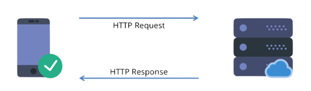
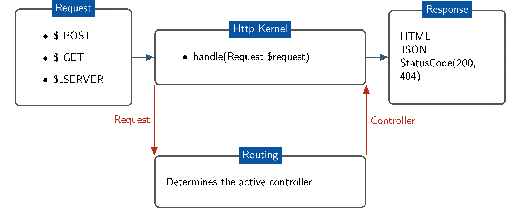
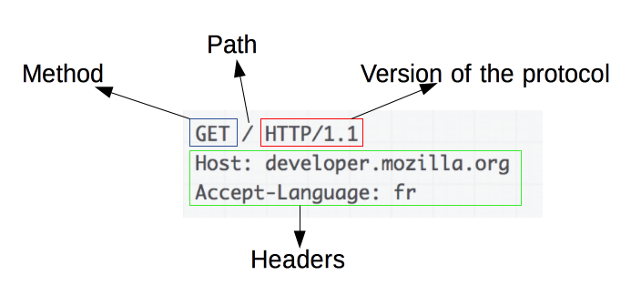
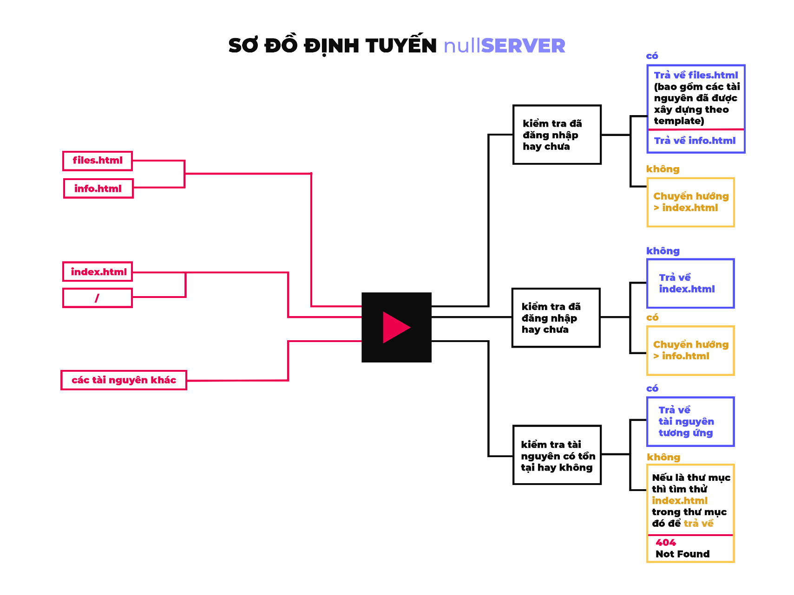

MÔ HÌNH HOẠT ĐỘNG
-----------------

<div style='text-align: center;'></div>

### Tổng quan

##### Về phía Client

<p style='text-align: justify;'>Máy khách gửi một yêu cầu đến máy chủ một gói dữ liệu gồm phương thức mà
máy khách muốn yêu cầu đến máy chủ, URI (đường dẫn đến tài nguyên) và
phiên bản của giao thức HTTP. Tiếp theo đó là các headers (thông điệp
MIME) chứa các thông tin về yêu cầu của máy khách, thông tin về máy
khách…</p>

##### Về phía Server

<p style='text-align: justify;'>Máy chủ phản hồi với một dòng trạng thái, bao gồm phiên bản giao thức
HTTP, mã trạng thái (status code). Tiếp theo đó là các headers (thông
điệp MIME) chứa các thông tin về server và về nội dung dữ liệu trả về.
Cuối cùng là gửi trả lại cho máy khách nội dung mà máy khách yêu cầu
    (nếu tồn tại).</p>

### Định tuyến

<div style='text-align: center;'></div>

<p style='text-align: justify;'>Khi nhận được một yêu cầu từ máy khách, server sẽ xử lý yêu cầu để xác
định đường dẫn của tài nguyên mà máy khách muốn truy cập, kiểm tra tài
nguyên đó có tồn tại và được quyền truy cập hay không. Nếu tài nguyên
tồn tại và được quyền truy cập thì server sẽ trả về một gói tin phản hồi
bao gồm mã trạng thái kèm với nội dung tài nguyên. Nếu tài nguyên không
tồn tại hoặc không được quyền truy cập thì trả về trạng thái 404 (Not
    Found).</p>

<p style='text-align: justify;'>Việc xác định và điều khiển hướng đi cho Response là nhiệm vụ của phần
định tuyến trong server. Các loại tài nguyên thông dụng được trả về
Content-Type theo MIME types. Tuy việc định tuyến được thực hiện tự động
dựa trên loại tài nguyên, nhưng cũng có một số ngoại lệ, ví dụ như khi
truy cập một đường dẫn, bộ phận định tuyến sẽ kiểm tra xem có tồn tại
file nào ở đường dẫn đã yêu cầu và có quyền truy cập hay không, nếu
không tìm thấy thì sẽ thử xem đường dẫn đó là một đường dẫn đến thư mục
và kiểm tra trong “thư mục” đó có tài nguyên HTML nào hay không, nếu có
thì sẽ hiển thị tài nguyên đó. Như vậy bộ phận định tuyến ưu tiên các
tài nguyên là file trước, nếu không tìm thấy thì sẽ thử xem đường dẫn đó
là một thư mục. Điều này sẽ giúp các truy cập có đường dẫn không rõ ràng
như “/” vẫn có thể truy cập bình thường vì lúc này server hiểu đường dẫn
    chính xác là “/index.html”.</p>

<p style='text-align: justify;'>Một ngoại lệ khác là điều hướng các truy cập từ “/files.html” hoặc
“/info.html” về “/index.html” nếu chưa đăng nhập (không có cookie hoặc
cookie không hợp lệ). Cùng với đó là điều hướng những truy cập từ
“/index.html” về “/info.html” nếu đã đăng nhập (đã đăng nhập thì không
    cần đăng nhập lại nên chuyển hướng về trang thông tin).</p>

### Xử lý thông điệp

#### HTTP Requests

##### GET Requests

<div style='text-align: center;'></div>

<p style='text-align: justify;'>Với các thông điệp yêu cầu, chúng ta cần xác định được phương thức,
đường dẫn và phiên bản HTTP. Tiếp đó là thông tin của các headers. Trong
khuôn khổ của đồ án này, chúng ta cần quan tâm nhất đến các headers:
If-Modified-Since và Cookie. Thực hiện cắt xâu để lấy các thuộc tính
    này.</p>

<p style='text-align: justify;'>Header <b>If-Modified-Since</b> là cách để client truy vấn thông tin về sự
chỉnh sửa của file sau lần cuối cùng truy cập, client sẽ gửi nội dung
của header này là thời gian của lần truy cập cuối cùng. Nếu file đã được
chỉnh sửa sau ngày này, server sẽ trả về toàn bộ thông tin như bình
thường, nếu file chưa được chỉnh sửa thì máy chủ sẽ chỉ gửi về status
code 304 (Not Modified) và không gửi kèm nội dung file, như vậy sẽ tiết
kiệm được thời gian trao đổi dữ liệu, client sẽ lấy dữ liệu từ cache để
    hiển thị.</p>

<p style='text-align: justify;'>Header <b>Cookie</b> được client dùng để thông báo cho server biết những
cookie (những tập tin được máy chủ gửi đến máy người dùng để ghi nhớ
những thông tin trạng thái, hoạt động của người dùng) nào đang được lưu
    tại client.</p>

```
Cookie: <cname1>=<cvalue1>; <cname2>=<cvalue2>;... 
```

#####  POST Requests

<p style='text-align: justify;'>Tương tự với GET Requests, chúng ta cần đọc các thông tin liên quan.
Khác biệt ở chỗ phương thức POST sẽ gửi kèm một đoạn dữ liệu để máy chủ
xử lý thông tin. Đoạn dữ liệu này được ngăn cách với header bằng một xâu
    ngăn cách <b>\r\n</b>.</p>

```
POST / HTTP/1.1\\r\\n

...\r\n

\r\n

<qname1>=<qvalue1>&<qname2>=<qvalue2>
```

<p style='text-align: justify;'>Từ dữ liệu nhận được từ POST Request có thể lấy ra dữ liệu gồm các
trường cần thiết như: username, password, remember. Sau khi có được dữ
liệu của các trường trên thì so sánh để xem thông tin tài khoản có hợp
lệ hay không. Tên đăng nhập và mật khẩu mặc định là “admin” và “admin”,
nếu thông tin đăng nhập khác so với thông tin tài khoản mặc định thì sẽ
điều hướng đến 404.html hoặc khi đăng nhập thành công thì điều hướng tới
    info.html.</p>

#### HTTP Responses

#####  Status Code 200 – OK

<p style='text-align: justify;'>Trả về khi yêu cầu của máy khách được máy chủ đáp ứng thành công. Dữ
liệu được yêu cầu sẽ trả về kèm theo HTTP Response.
    </p>
<p style='text-align: justify;'>Ta có thể gửi kèm header <b>Expires</b> để quy định ngày hết hạn của tài
nguyên này, khi trôi qua ngày hết hạn, client sẽ buộc phải làm mới lại
    dữ liệu.</p>
##### Status Code 303 – See Other

<p style='text-align: justify;'>Trả về khi máy khách đăng nhập thành công vào trang web này, nó giúp
chuyển hướng đến trang thông tin là info.html bằng cách sử dụng phương
    thức GET.</p>

#####  Status Code 304 – Not Modified

<p style='text-align: justify;'>Trả về khi máy khách đã truy cập trang web này trước đó, khi truy cập
    lại một lần nữa client sẽ gửi header truy vấn <b>If-Modified-Since</b>, nếu
tài nguyên này chưa được chỉnh sửa sau lần truy cập gần nhất thì server
sẽ trả về status code 304 và không gửi kèm nội dung tài nguyên. Trình
    duyệt ở client sẽ hiển thị dữ liệu đã lưu ở cache</p>

#####  Status Code 404 – Not Found

<p style='text-align: justify;'>Trả về khi máy khách truy cập một tài nguyên không tồn tại, server trả
lời lại bằng status code 404 để thông báo rằng tài nguyên này không thể
    được đáp ứng.</p>

### Giao tiếp giữa UI và server

<p style='text-align: justify;'>Giao diện được thiết kế theo hướng tối giản để giúp người sử dụng dễ
tiếp cận, các thông tin quan trọng nằm ở vị trí dễ nhìn thấy. Riêng
trang download được xây dựng sẵn template cho các blocks và
đặt một block giữ chỗ trong tập tin HTML để server có thể nhận biết
vị trí chèn thông tin các blocks là danh sách các file hiện có trong thư
mục “download”. Khi xây dựng trang download theo hướng như thế thì khi
có tài nguyên mới được thêm vào thư mục download, người dùng sẽ không
cần phải thêm thông tin file thủ công vào file HTML mà việc đó đã được
thực hiện tự động nhờ bộ phận quét thông tin file và chèn nó vào trang
    download cho người dùng cuối.</p>

### Kiểu truyền tải

<p style='text-align: justify;'><b>Transfer-Encoding</b> header dùng để thông báo kiểu truyền tải với tài
    nguyên sắp được server trả lời. Với loại truyền tải <b>chunked</b>, nội
dung của tài nguyên được chia thành các “bó” tin nhỏ, server sẽ thông
báo về kích thước của mỗi bó tin (ở hệ 16 – hexadecimal) trước khi gửi
nội dung của bó tin đó. Sau bó tin cuối cùng, server sẽ gửi kích thước
    bó tin kết thúc là 0byte sau đó kết thúc bằng <b>\r\n</b>.

<p style='text-align: justify;'>Kiểu truyền tải này được sử dụng trong chức năng download, các tài
nguyên trong trang download có kích thước lớn hơn hẳn các tài nguyên
HTML, CSS hay JS cần thiết để tải trang. Có thể tồn tại những tập tin
kích thước rất lớn đến vài trăm MB, vài GB hoặc thậm chí là TB. Để
truyền tải những nội dung có kích thước lớn như vậy, server không thể
đọc toàn bộ tài nguyên ấy để truyền cho máy khách, việc đó hao tốn
rất lớn chi phí vận hành của server. Để giải quyết vấn đề này thì
server sẽ thực hiện chia tài nguyên kích thước lớn thành các bó tin có
    kích thước nhỏ hơn để gửi cho máy khách theo kiểu truyền tải chunked.</p>

TRIỂN KHAI ỨNG DỤNG
-------------------

<div style='text-align: center;'></div>

### Định tuyến

*Bộ phận định tuyến được triển khai theo sơ đồ như bên trên*

<p style='text-align: justify;'>Bộ mã nguồn frontend của đồ án này được lưu trong thư mục <b>web-source</b>
    nằm cùng đường dẫn với file thực thi của server</p>

<p style='text-align: justify;'>Với các truy cập đến “files.html” và “info.html”, bộ phận định
tuyến sẽ kiểm tra xem có cookie nào được lưu ở máy khách và cookie đó có
hợp lệ hay không. Nếu hợp lệ (tức người dùng đã đăng nhập) thì cho phép
truy cập vào các tài nguyên này, nếu không thì chuyển hướng người dùng
về lại trang đăng nhập. Ngược lại, với các truy cập đến "index.html”
và “/”, server cũng kiểm tra cookie, nếu đã đăng nhập rồi thì sẽ
chuyển hướng người dùng sang trang thông tin “info.html”. Với các tài
nguyên không nằm trong nhóm ngoại lệ bên trên, server sẽ kiểm tra xem
tài nguyên đó có tồn tại hay không, nếu không tồn tại thì thử tìm xem đó
có phải thư mục hay không, nếu là thư mục thì trả về file “index.html”
trong thư mục đó, nếu không có file “index.html” trong thư mục đó hoặc
đó không phải thư mục và tài nguyên đó cũng không tồn tại thì trả về mã
    lỗi 404 (Not Found) và trả về nội dung “404.html”.</p>

### Xử lý đa luồng

<p style='text-align: justify;'>Do mỗi trang web được yêu cầu không chỉ bao gồm 1 request mà bao gồm nhiều request đến tất cả các tài nguyên được nhúng vào trang web mà người dùng yêu cầu. Để đảm bảo tốc độ load trang, ta không thể chờ xử lý xong request này rồi mới xử lý tiếp các request khác. Hơn nữa, do tính chất của server phục vụ cho nhiều máy khách, không thể để một máy khách chờ được phục vụ trong khi đang đáp ứng cho máy khách khác. Chính vì những lý do này mà ta cần xử lý mỗi request ở một thread riêng độc lập với session chính.</p>

### Xây dựng giao diện cho người dùng cuối

<p style='text-align: justify;'>Thư mục mã nguồn web-source bắt buộc phải nằm cùng đường dẫn với
    file thực thi để máy chủ có thể hoạt động chính xác</p>
<p style='text-align: justify;'>Với ý tưởng về việc xây dựng một trang download tự động lấy các thông
tin file và hiển thị lên giao diện cho người dùng cuối như đã trình bày
trong mục Mô Hình Hoạt Động. Việc triển khai xây dựng giao diện dễ giao
    tiếp với máy chủ được thực hiện như sau:</p>
**Block giữ chỗ:** *&lt;//nullSERVER?FILES?//&gt;*

<p style='text-align: justify;'>Máy chủ sẽ tìm block giữ chỗ này, sau đó thay thế block này bằng các
    template đã được xây dựng sẵn như bên dưới.</p>

<p style='text-align: justify;'><b>Một block thông tin file khi được máy chủ chèn vào HTML có dạng như
    template sau:</b></p>

```html
<div class="content-box">
	
	<div class="file-details">
		<a href= {đường dẫn đến file}> {tên file} </a>
		<h2>Size: {kích thước file} </h2>
	</div>
</div>
```

<p style='text-align: justify;'>Trong đó, những thuộc tính {màu xanh} được server tự động thay đổi tuỳ
theo từng tập tin. Với mỗi file được quét trong thư mục download, server
sẽ thêm một template bên trên và điền các thông tin của file vừa quét
vào, lặp lại công việc này với tất cả các file trong thư mục download ta
    sẽ có được danh sách những file có thể được người dùng cuối tải về.</p>

<p style='text-align: justify;'>Trang đăng nhập gửi về server 3 trường dữ liệu là <b>username</b>,
    <b>password</b> và <b>remember</b> với phương thức POST. Các trường dữ
liệu trong form đăng nhập là các trường bắt buộc nhập, nếu không có nội
    dung được nhập thì không thể submit các nội dung này gửi đến máy chủ.</p>

### Truyền tải dữ liệu

<p style='text-align: justify;'>Transfer-Encoding: chunked được tận dụng tối đa thế mạnh nhờ bộ phận
chia tài nguyên cần truy cập thành các bó tin nhỏ, tránh đọc dữ liệu hết
    cả file trong 1 lần để tiết kiệm tài nguyên hệ thống.</p>

<p style='text-align: justify;'>Đối với các file HTML, CSS, JS được truy vấn để hiển thị cho người dùng
    cuối đều được truyền tải bằng phương thức thông thường (truyền cả file)</p>

Source Code
-------------------

Xem source code trên <a href='https://www.github.com/cngthnh'><b>GitHub</b></a>