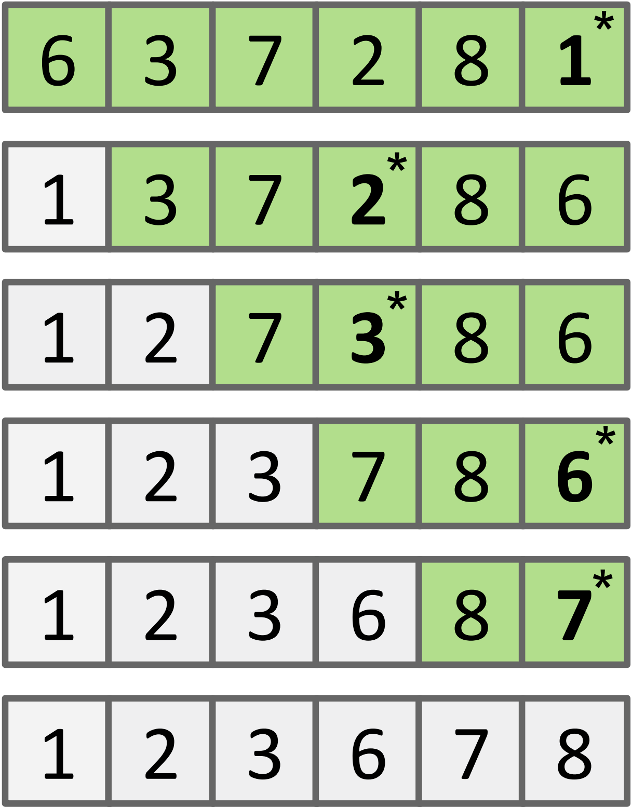
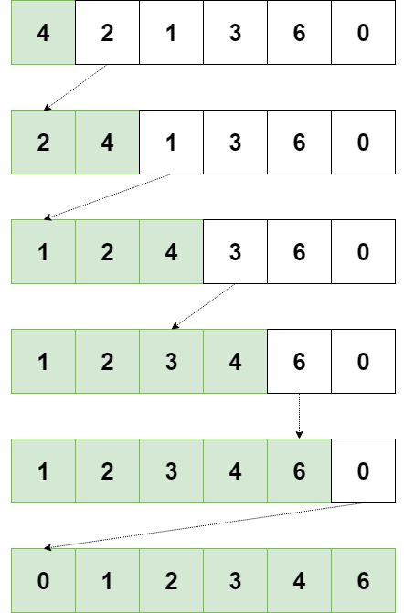
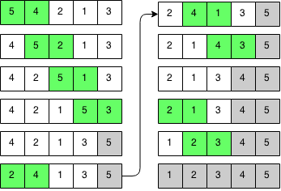
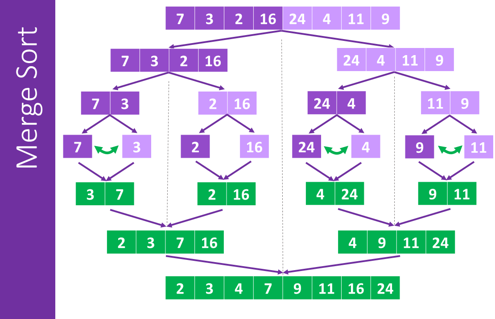
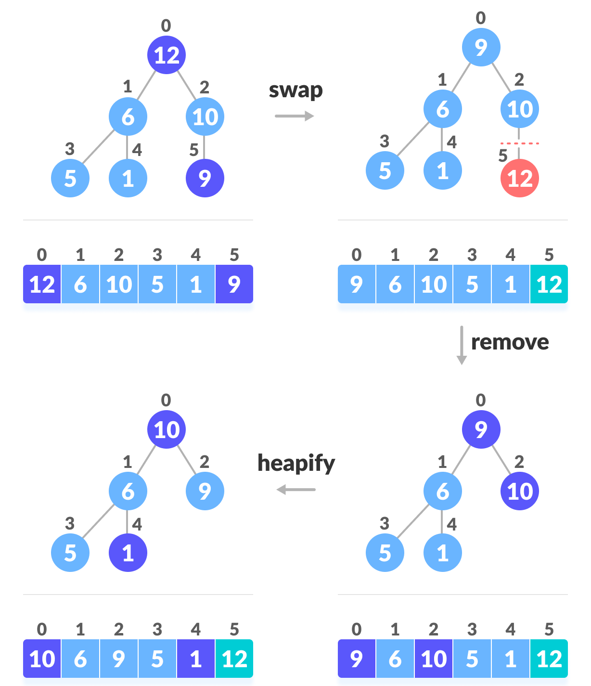
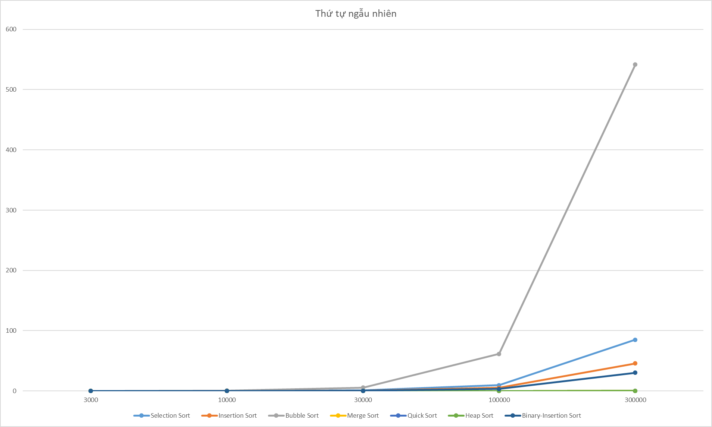
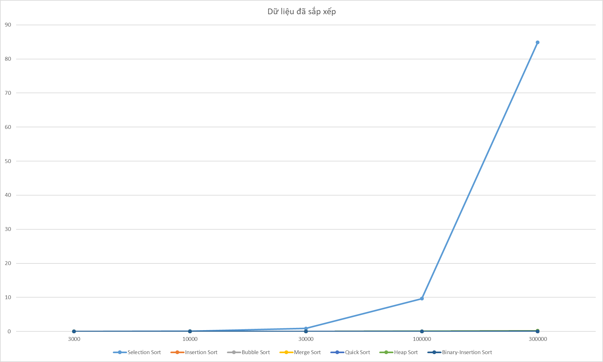
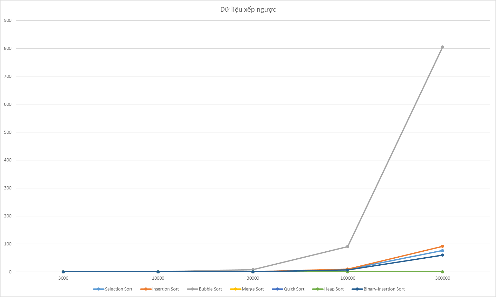
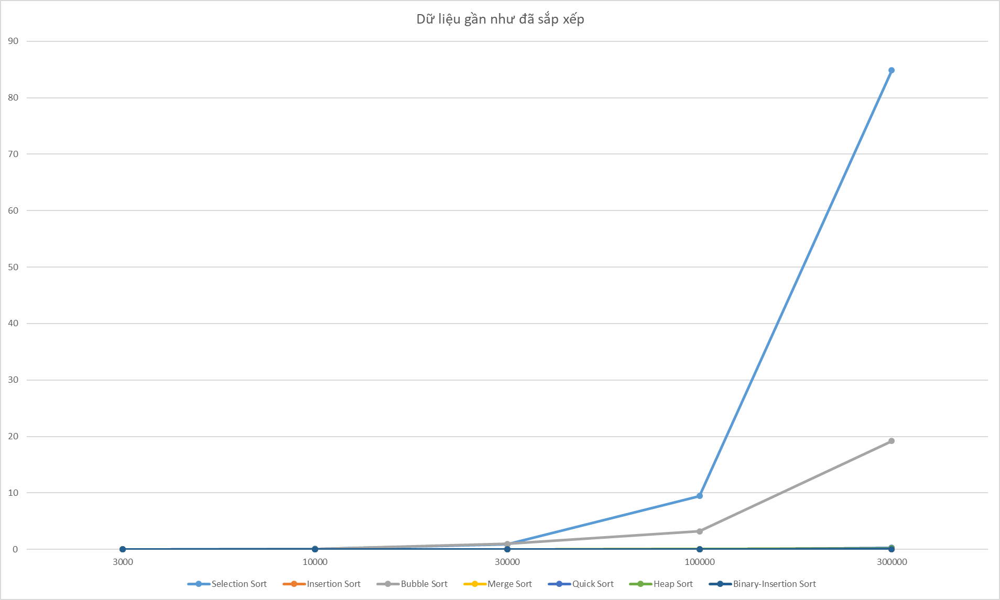

### Trình bày thuật toán

#### Selection Sort

##### Ý tưởng

<p style='text-align: justify;'>
    Với trường hợp sắp xếp mảng tăng dần có <b><i>n</i></b> phần tử, thuật toán Selection Sort (sắp xếp chọn) chia mảng thành 2 mảng con đã sắp xếp và chưa sắp xếp. Sau đó, tìm phần tử nhỏ nhất của mảng con chưa sắp xếp và di chuyển phần tử đó về cuối mảng con đã sắp xếp. Ban đầu chưa có phần tử nào được sắp xếp, phần tử được chọn để so sánh là phần tử đầu tiên của mảng, so sánh phần tử đó với phần tử nhỏ nhất trong <b><i>n-1</i></b> phần tử còn lại, nếu phần tử được chọn lớn hơn phần tử nhỏ nhất của mảng con còn lại thì đổi chỗ 2 phần tử đó cho nhau. Tại mỗi vòng lặp, phần tử được chọn sẽ có vị trí tiến lên 1 đơn vị so với vòng lặp trước do sau mỗi vòng lặp sẽ có thêm 1 phần tử được di chuyển vào mảng con đã sắp xếp.
</p>


##### Minh hoạ thuật toán

```c++
void selectionSort(int* a, int n)
{
    for (int i = 0; i < n - 1; i++)
    {
        int min = i; 
        //phần tử thứ i là phần tử được chọn, phần tử này tạm thời là min
        for (int j = i + 1; j < n; j++) if (a[j] < a[min]) min = j; 
        //so sánh từng phần tử trong mảng con chưa sắp xếp với min hiện tại, nếu nhỏ hơn thì đó là min
        swap(a[min], a[i]); //đổi chỗ min và phần tử được chọn
    }
}
```

<div style='text-align: center;'>
    <br>
    <p>
	Thay đổi của các phần tử trên mảng qua mỗi vòng lặp, phần tử có dấu * được đổi chỗ với phần tử đầu tiên trong mảng chưa sắp xếp (mảng màu xanh lá)
    </p>
</div>


##### Đánh giá thuật toán

-   Độ phức tạp thời gian:

    -   Xấu nhất: ***O(n<sup>2</sup>)***

    -   Trung bình: ***O(n<sup>2</sup>)***

    -   Tốt nhất: ***O(n<sup>2</sup>)***

-   Bộ nhớ sử dụng: ***O(1)*** do không sử dụng mảng phụ

#### Insertion Sort

##### Ý tưởng

<p style='text-align: justify;'>
    Thuật toán Insertion Sort (sắp xếp chèn) duyệt từng phần tử và chèn phần tử đó vào mảng con (là mảng từ phần tử đầu tiên đến phần tử phía trước phần tử đã chọn) đã sắp xếp sao cho mảng đã sắp xếp đó vẫn giữ nguyên tính chất tăng hoặc giảm.
</p>


##### Minh hoạ thuật toán

```c++
void insertionSort(int* a, int n)
{
    int i, j, key;
    for (i = 1; i < n; i++) 
    //duyệt i từ 1 đến n, vì mảng con có 1 phần tử ở vị trí 0 luôn luôn đã được sắp xếp
    {
        key = a[i]; 
        //chọn phần tử thứ i để chèn vào mảng con gồm các phần tử đứng trước i
        for (j = i - 1; j >= 0; j--) 
        //duyệt mảng con đứng trước i (mảng này đã sắp xếp tăng hoặc giảm)
        {
            if (a[j] <= key) break; 
            //nếu a[j] <= key thì cần chèn key vào vị trí thứ j+1 để giữ nguyên tính chất của mảng con đứng trước i
            a[j + 1] = a[j]; 
            //nếu vẫn chưa tìm thấy vị trí cần chèn thì dời các phần tử lên 1 đơn vị để chừa chỗ chèn key
        }
        a[j + 1] = key; chèn key vào vị trí j+1
    }
}
```

<div style='text-align: center;'>
    <br>
    <p>
	Thay đổi của các phần tử trên mảng qua mỗi vòng lặp, các phần tử được di chuyển theo hướng mũi tên
    </p>
</div>


##### Đánh giá thuật toán

-   Độ phức tạp thời gian:

    -   Xấu nhất: ***O(n<sup>2</sup>)***

    -   Trung bình: ***O(n<sup>2</sup>)***

    -   Tốt nhất: ***O(n)*** - trong trường hợp mảng đã sắp xếp sẵn

-   Bộ nhớ sử dụng: ***O(1)*** do không sử dụng mảng phụ

#### Bubble Sort

##### Ý tưởng

<p style='text-align: justify;'>
    Thuật toán Bubble Sort (sắp xếp nổi bột) lặp lại công việc đổi chỗ 2 số kế nhau nếu chúng đang đứng sai thứ tự cho đến khi mảng được sắp xếp. Trong mỗi chu trình nổi bọt, giá trị lớn nhất (hoặc nhỏ nhất) trong mảng chưa sắp xếp sẽ dần dần “nổi” lên trên, nhập vào mảng đã sắp xếp.
</p>


##### Minh hoạ thuật toán

<p style='text-align: justify;'>
    Trong cài đặt Bubble Sort này, đã cải tiến bằng cách đặt 1 flag đánh dấu nếu không có sự hoán vị nào xảy ra (tức là mảng đã được sắp xếp và không cần chạy các vòng lặp còn lại nữa).
</p>

```c++
void bubbleSort(int* a, int n)
{
    bool isSwapped = 0; //flag đánh dấu mảng đã được sắp xếp hay chưa
    for (int i = 0; i < n - 1; i++)
    {
        //phần tử cuối cùng luôn nằm đúng vị trí
        isSwapped = 0;
        for (int j = 0; j < n - i - 1; j++)
        //duyệt các phần tử chưa được sắp xếp và đẩy phần tử lớn nhất (hoặc nhỏ nhất) lên cuối dãy
        //duyệt j < n - i - 1 vì xét phần tử kế là j+1 = n - i => không tràn sang mảng con đã sắp xếp ở cuối dãy
            if (a[j] > a[j + 1])
            {
                swap(a[j], a[j + 1]);
                //nếu 2 phần tử kế nhau nằm sai vị trí thì đổi chỗ
                isSwapped = 1;
            }
        if (!isSwapped) return;
        //nếu đã sắp xếp thì dừng
    }
}
```

<div style='text-align: center;'>
    <br>
    <p>
	Đổi chỗ 2 ô màu xanh lá qua mỗi bước, những ô màu xám đã được sắp xếp, ô màu trắng chưa được sắp xếp
    </p>
</div>


##### Đánh giá thuật toán

-   Độ phức tạp thời gian:

    -   Xấu nhất: ***O(n<sup>2</sup>)***

    -   Trung bình: ***O(n<sup>2</sup>)***

    -   Tốt nhất: ***O(n)*** - trong trường hợp mảng đã sắp xếp sẵn, vòng lặp chạy 1 lần rồi được gắn cờ đã sắp xếp và dừng hàm.
    
-   Bộ nhớ sử dụng: ***O(1)*** do không sử dụng mảng phụ

#### Merge Sort

##### Ý tưởng

<p style='text-align: justify;'>
    Thuật toán Merge Sort (sắp xếp trộn) là một thuật toán chia để trị, thuật toán này sẽ chia mảng ra thành 2 mảng con, và tiếp tục công việc này với các mảng con đã chia cho tới khi nào những mảng con chỉ còn lại 1 phần tử, khi đó mỗi mảng con đều đã được sắp xếp do chỉ có 1 phần tử. Sau đó, thực hiện trộn các mảng con đã sắp xếp lại thành mảng con lớn hơn, lặp lại việc trộn mảng đến khi ta có mảng kết quả là toàn bộ các phần tử ban đầu đã được sắp xếp.
</p>

##### Minh hoạ thuật toán

```c++
void merge(int* a, int l, int m, int r)
{
    /*đoạn này copy mảng con trái vào mảng L, mảng con phải vào mảng R; mảng con L có n1 phần tử, R có n2 phần tử*/

    //thực hiện trộn 2 mảng L và R như sau: 
    for (int k = l; k <= r; k++)
    {
        if (i > n1-1) a[k] = R[j++]; // nếu đã hết phần tử trong mảng L thì chỉ cho những phần tử của mảng R vào mảng kết quả
        else if (j > n2-1) a[k] = L[i++]; // nếu đã hết phần tử trong R thì cho những phần tử của L vào mảng kết quả 
        else if (L[i] > R[j]) a[k] = R[j++]; //nếu L[i]>R[j] thì cho R[j] vào mảng kết quả
        else a[k] = L[i++]; //còn lại thì cho L[i] vào mảng kết quả (nếu L[i]==R[j] thì cho L[i] vào mảng, L luôn nằm bên trái R nên đảm bảo tính ổn định)
    }
}
void mergeSort(int* a, int l, int r) {
    if (l >= r)  return;
    int m = (l + r - 1) / 2; //phần tử giữa mảng
    mergeSort(a, l, m); //gọi đệ quy mảng con từ m trở về bên trái
    mergeSort(a, m + 1, r); //gọi đệ quy mảng con bên phải m
    merge(a, l, m, r); //gộp 2 mảng con
}
```

<div style='text-align: center;'>
    <br>
    <p>
	Màu tím là quá trình chia mảng thành các mảng con, màu xanh là quá trình trộn mảng, chia đến khi thành các mảng chỉ có 1 phần tử sau đó trộn các mảng đó lại
    </p>
</div>


##### Đánh giá thuật toán

-   Độ phức tạp thời gian:

    -   Xấu nhất: ***O(nlog<sub>2</sub>n)***

    -   Trung bình: ***O(nlog<sub>2</sub>n)***

    -   Tốt nhất: ***O(nlog<sub>2</sub>n)***

-   Bộ nhớ sử dụng: ***O(n)*** do phải sử dụng các mảng con tạm để lưu giá trị trước khi trộn chúng thành mảng kết quả

#### Quick Sort

##### Ý tưởng

<p style='text-align: justify;'>
    Thuật toán Quick Sort là một thuật toán chia để trị với mấu chốt là thuật toán phân hoạch, chọn một phần tử trên mảng làm phần tử đánh dấu (pivot), sau đó di chuyển tất cả các phần tử nhỏ hơn pivot sang bên trái và các phần tử lớn hơn pivot sang bên phải. Lặp lại việc này với mỗi phân đoạn đã chia ta sẽ có được mảng đã sắp xếp
</p>

##### Minh hoạ thuật toán

<p style='text-align: justify;'>
    Trong cài đặt này, sử dụng pivot ngẫu nhiên sẽ tránh được trường hợp xấu với mảng sắp xếp ngược
</p>

```c++
void quickSort(int* a, int l, int r)
{
    srand(time(NULL)); 
    int key = a[l + rand() % (r - l + 1)];
    int i = l, j = r;
    while (i <= j) //nếu đã duyệt hết mảng thì dừng vòng lặp
    {
        while (a[i] < key) i++; //tìm phần tử bên trái lớn hơn pivot
        while (a[j] > key) j--; //tìm phần tử bên phải nhỏ hơn pivot
        if (i <= j)
        {
            //nếu i vẫn nằm bên trái pivot và j vẫn nằm bên phải pivot và phần tử a[i]>a[j] thì đổi chỗ 2 phần tử này
            if (i < j) swap(a[i], a[j]);
            //đã xử lý xong 2 phần tử này, tăng i, giảm j để sang phần tử khác
            i++;
            j--;
        }
    }
    //nếu l<j tức là mảng con bên trái còn nhiều hơn 1 phần tử, tiếp tục lặp lại thao tác cho mảng con bên trái
    if (l < j) quickSort(a, l, j);
    //nếu i<r tức là mảng con bên phải còn nhiều hơn 1 phần tử, tiếp tục lặp lại thao tác cho mảng con bên phải
    if (i < r) quickSort(a, i, r); 
}
```

<div style='text-align: center;'>
    <br>
    <p>
	Các phần tử khác màu tím là các phần tử được chọn làm pivot trong mỗi phân đoạn, các phân tử màu tím nhỏ hơn sẽ được di chuyển về bên trái pivot, lớn hơn sẽ di chuyển về bên phải pivot
    </p>
</div>


##### Đánh giá thuật toán

-   Độ phức tạp thời gian:

    -   Xấu nhất: ***O(n<sup>2</sup>)*** - trong trường hợp pivot luôn bị random trúng phần tử lớn nhất (hoặc bé nhất)
    
    -   Trung bình: ***O(nlog<sub>2</sub>n)***
    
    -   Tốt nhất: ***O(nlog<sub>2</sub>n)***
    
-   Bộ nhớ sử dụng: ***O(nlog<sub>2</sub>n)*** trong trường hợp trung bình và ***O(n)*** trong trường hợp pivot luôn bị random trúng phần tử lớn nhất (hoặc bé nhất) khiến việc phân hoạch bị lệch thành 1 mảng con có ***1*** phần tử và mảng con còn lại có ***n-1*** phần tử =&gt; sử dụng ***n*** callstack

#### Heap Sort

##### Ý tưởng

<p style='text-align: justify;'>
    Heap Sort có thể được xem là phiên bản cải tiến của Selection Sort với cơ chế tìm phần tử lớn nhất (hoặc nhỏ nhất) của mảng con chưa sắp xếp và di chuyển vào mảng con đã sắp xếp. Khác biệt nằm ở chỗ Heap Sort sử dụng cấu trúc heap để tìm phần tử lớn nhất (hoặc nhỏ nhất) thay vì tìm kiếm tuyến tính. Cấu trúc heap có thể biểu diễn ở dạng cây nhị phân cân bằng như bên dưới để dễ hình dung cách hoạt động của thuật toán này.
</p>

##### Minh hoạ thuật toán

```c++
void heapify(int* a, int n, int i)
{
    //giá trị lớn nhất là giá trị tại nút đang xét
    int largest = i;
    int l = 2 * i + 1; //vị trí nút con bên trái
    int r = 2 * i + 2; //vị trí nút con bên phải
    //nếu nút con bên trái lớn hơn nút đang xét thì gán nút con trái là lớn nhất
    if (l < n && a[l] > a[largest]) largest = l;
    //nếu nút con bên phải lớn hơn nút đang xét thì gán nút con phải là lớn nhất
    if (r < n && a[r] > a[largest]) largest = r;
    if (largest != i) 
    {
        //nếu giá trị lớn nhất không phải là nút cha thì hoán đổi giá trị nút cha và nút con lớn nhất để nút cha trở thành lớn nhất và đệ quy với nút con vừa đổi giá trị để đảm bảo nút cha luôn lớn hơn nút con trên toàn bộ cây
        swap(a[i], a[largest]);
        heapify(a, n, largest);
    }
}
void heapSort(int* a, int n)
{
    //thực hiện tái cấu trúc mảng ban đầu thành heap (nút cha luôn lớn hơn nút con)
    //các nút lớn hơn n/2-1 là các nút lá nên không cần xây dựng heap
    for (int i = n / 2 - 1; i >= 0; i--) heapify(a, n, i);
    //vì nút cha là nút lớn nhất nên ta sẽ đổi giá trị ở nút cha và nút lá cuối cùng bên phải và ngắt nút lá đó ra khỏi cây
    //nút lá đó chính là phần tử đã được sắp xếp
    for (int i = n - 1; i > 0; i--)
    {
        swap(a[0], a[i]);
        heapify(a, i, 0); //thực hiện build heap lại với nút cha mới
    }
}
```

<div style='text-align: center;'>
    <br>
    <p>
	[Xây dựng heap - Đổi chỗ nút cha và nút lá cuối cùng bên phải - Ngắt nút lá] và lặp lại thao tác này cho tới khi nào mảng chỉ còn duy nhất một phần tử. Phần tử màu xanh lá cây trong hình trên là phần tử đã được sắp xếp
    </p>
</div>


##### Đánh giá thuật toán

-   Độ phức tạp thời gian: Chiều cao của cây là ***nlog<sub>2</sub>n*** và mất ***n*** lần duyệt cây để có được mảng đã sắp xếp
    -   Xấu nhất: ***O(nlog<sub>2</sub>n)***

    -   Trung bình: ***O(nlog<sub>2</sub>n)***

    -   Tốt nhất: ***O(nlog<sub>2</sub>n)***

-   Bộ nhớ sử dụng: ***O(1)*** (không sử dụng mảng phụ)

#### Binary Insertion Sort

##### Ý tưởng

<p style='text-align: justify;'>
    Binary Insertion Sort là phiên bản cải tiến của Insertion Sort, nó dùng thuật toán tìm kiếm nhị phân (chặt nhị phân - Binary Search) để tìm vị trí chèn phần tử ở mảng con chưa sắp xếp vào mảng con đã sắp xếp sao cho vẫn giữ nguyên tính chất tăng hoặc giảm.
</p>

##### Minh hoạ thuật toán

```c++
int binarySearch(int* a, int l, int r, int selected)
{
    while (l < r)
    {
        int m = (l + r) / 2;
        if (a[m] == selected) 
        {
            //nếu có nhiều phần tử trùng nhau thì chèn vào sau phần tử trùng cuối cùng => Đảm bảo tính ổn định
            while (a[++m] == selected);
            if (m > r) return r + 1;
            return m;
        }
        else if (a[m] < selected) l = m + 1; //nếu a[m] nhỏ hơn phần tử đã chọn thì vị trí chèn nằm bên phải m
        else r = m - 1; //ngược lại thì vị trí chèn nằm bên trái m
    }
    //nếu không có phần tử nào trong mảng con đã sắp xếp bằng với phần tử đã chọn thì xét tại a[l], nếu a[l] lớn hơn thì chèn vào trước a[l]
    if (a[l] > selected) return l;
    //ngược lại thì chèn vào sau a[l]
    return l+1;
}
void binaryInsertionSort(int* a, int n)
{
    for (int i = 1; i < n; i++)
    {
        int selected = a[i];
        int j = i - 1;
        int found = binarySearch(a, 0, j, selected);
        //dời các phần tử sau vị trí đã tìm sang bên phải 1 đơn vị để chừa chỗ chèn giá trị
        while (j >= found)
        {
            a[j + 1] = a[j];
            j--;
        }
        //chèn vào vị trí đã tìm
        a[found] = selected;
    }
}
```

<p style='text-align: center;'>
    Hình ảnh trực quan minh hoạ cho sự dịch chuyển của các phần tử trong mảng tương tự như Hình 2 (phần Insertion Sort)
</p>

##### Đánh giá thuật toán

-   Độ phức tạp thời gian:

    -   Xấu nhất: ***O(n<sup>2</sup>)***

    -   Trung bình: ***O(n<sup>2</sup>)***

    -   Tốt nhất: ***O(nlog<sub>2</sub>n)*** - trong trường hợp mảng đã sắp xếp sẵn, mất ***log<sub>2</sub>n*** lần chặt nhị phân và ***n*** vòng lặp duyệt mảng
    
-   Bộ nhớ sử dụng: ***O(1)*** (không sử dụng mảng phụ)

### Thực nghiệm

#### Dữ liệu có thứ tự ngẫu nhiên

<div style='text-align: center;'>
    <br>
    <p>
	Biểu đồ thời gian chạy của các thuật toán sắp xếp với dữ liệu thứ tự ngẫu nhiên
    </p>
</div>


##### Nhận xét

-   Các thuật toán Merge Sort, Quick Sort, Heap Sort đều chạy rất nhanh (dưới 0.3s ở bài test có dữ liệu lớn nhất), trong đó Quick Sort nhanh hơn ở hầu hết các bài test.
    
-   Thuật toán Bubble Sort có thời gian chạy lâu nhất, gấp nhiều lần các thuật toán khác. Bubble Sort chậm hơn tất cả các thuật toán khác trong nhóm thuật toán sắp xếp chậm mặc dù được đánh giá cùng với độ phức tạp thời gian ***O(n<sup>2</sup>)*** do phải thực hiện phép hoán vị và duyệt lại mảng quá nhiều lần (dù đã cải tiến bằng cách thoát vòng lặp duyệt mảng nếu phát hiện mảng đã sắp xếp).
    
-   Insertion Sort và Binary Insertion Sort mất thời gian dưới 50s ở bài test có dữ liệu lớn nhất, trong đó Binary Insertion Sort nhanh hơn Insertion Sort khoảng 30% do cải tiến việc tìm vị trí bằng chặt nhị phân.

#### Dữ liệu đã được sắp xếp

<div style='text-align: center;'>
    <br>
    <p>
	Biểu đồ thời gian chạy của các thuật toán sắp xếp với dữ liệu đã được sắp xếp
    </p>
</div>


##### Nhận xét

-   Tất cả các thuật toán đều chạy rất nhanh (dưới 0.3s ở bài test có dữ liệu lớn nhất) với mảng đã được sắp xếp sẵn, trừ Selection Sort do cách tìm kiếm phần tử nhỏ nhất theo phương pháp tìm kiếm tuần tự nên phải duyệt lại mảng rất nhiều lần.
    
-   Insertion Sort chạy nhanh hơn hẳn so với khi sắp xếp mảng ngẫu nhiên do việc tìm vị trí bắt đầu từ ngay trước điểm đã chọn để chèn và vị trí cần chèn chính là chỗ cũ nên thời gian tìm vị trí và dời các phần tử là ***O(1)***, cộng thêm duyệt mảng mất ***O(n)*** nên tổng độ phức tạp thời gian của Insertion Sort ở bài test này chỉ là ***O(n)***.
    
-   Binary Insertion Sort ở bài test này chậm hơn so với Insertion Sort một chút, do phương pháp chặt nhị phân nên thời gian tìm kiếm vị trí mất ***O(log<sub>2</sub>n)*** thay vì ***O(1)***, thời gian dời các phần tử là ***O(1)*** do vị trí chèn chính là chỗ cũ, vậy nên tổng độ phức tạp thời gian của Binary Insertion Sort ở bài test này là ***O(nlog<sub>2</sub>n)***.
    
-   Bubble Sort chạy nhanh hơn hẳn so với mảng ngẫu nhiên do đã cải tiến, nếu duyệt qua mảng mà không có bất kì phép hoán vị nào tức là mảng đã sắp xếp và không cần sắp xếp nữa, ở bài test này độ phức tạp là ***O(n)***.
    
-   Các thuật toán Quick Sort, Merge Sort, Heap Sort vẫn rất nhanh, chênh lệch không lớn so với mảng ngẫu nhiên.

#### Dữ liệu đã sắp xếp ngược

<div style='text-align: center;'>
    <br>
    <p>
	Biểu đồ thời gian chạy của các thuật toán sắp xếp với dữ liệu đã sắp xếp ngược
    </p>
</div>


##### Nhận xét

-   Bubble Sort thể hiện rất tệ ở mảng sắp xếp ngược, do phải thực hiện ***O(n)*** phép hoán vị mới có thể làm phần tử lớn nhất “nổi bọt” đến cuối mảng
    
-   Insertion Sort và Binary Insertion Sort sắp xếp lâu gấp đôi so với mảng ngẫu nhiên, do với mỗi lần chèn phần tử đều phải dời toàn bộ mảng con đã sắp xếp để chèn phần tử vào (do mảng xếp ngược có phần tử đứng sau luôn bé hơn phần tử đứng trước). Binary Insertion Sort vẫn nhanh hơn Insertion Sort khoảng 30%
    
-   Selection Sort có thời gian chạy không thay đổi quá nhiều so với mảng ngẫu nhiên và mảng đã sắp xếp, do thuật toán này luôn phải duyệt lại mảng nhiều lần để tìm kiếm tuần tự phần tử min trong mảng chưa sắp xếp
    
-   Merge Sort, Quick Sort và Heap Sort vẫn rất nhanh (dưới 0.3s ở bài test có dữ liệu lớn nhất) và không chênh lệch nhau nhiều, Quick Sort nhanh hơn một chút so với hai thuật toán còn lại

#### Dữ liệu gần như đã sắp xếp

<div style='text-align: center;'>
    <br>
    <p>
	Biểu đồ thời gian chạy của các thuật toán sắp xếp với dữ liệu gần như đã sắp xếp
    </p>
</div>


##### Nhận xét

-   Selection Sort vẫn giữ thời gian chạy giống như các mảng với thứ tự sắp xếp ngẫu nhiên, đã sắp xếp và sắp xếp ngược do tính chất của thuật toán.
    
-   Bubble Sort với mảng gần như sắp xếp chạy nhanh hơn Selection Sort và nhanh hơn khi sắp xếp các mảng ngẫu nhiên và sắp xếp ngược do chỉ có một vài phần tử bị xáo trộn, nên chỉ phải duyệt lại mảng ***k*** lần (với ***k*** là số phần tử nằm sai vị trí) và số lần hoán vị với mỗi vòng lặp nhỏ hơn hoặc bằng ***n*** (tuỳ thuộc vị trí của phần tử bị xáo trộn).
    
-   Các thuật toán còn lại đều sắp xếp rất nhanh (dưới 0.3s với bài test có dữ liệu lớn nhất). Trong đó Insertion Sort và Binary Insertion Sort là nhanh nhất do chỉ phải chèn ***k*** phần tử bị xáo trộn vào mảng đã sắp xếp.
    
-   Merge Sort, Quick Sort, Heap Sort sắp xếp mảng gần như đã sắp xếp với thời gian gần như tương tự các sắp xếp mảng khác.

#### Đánh giá tổng quan

##### Đánh giá

-   Thuật toán Quick Sort nhanh hơn ở hầu hết các trường hợp (trừ mảng đã sắp xếp do đây là trường hợp đặc biệt của Bubble Sort, Insertion Sort và Binary Insertion Sort nên các thuật toán này chạy nhanh hơn).
-   Bubble Sort chậm nhất ở hầu hết các trường hợp (trừ trường hợp mảng đã sắp xếp).
-   Insertion Sort, Binary Insertion Sort, Bubble Sort sắp xếp chậm ở các mảng ngẫu nhiên, mảng xếp ngược. Nhưng lại nhanh hơn rõ rệt ở mảng đã sắp xếp hoặc gần như sắp xếp.
-   Heap Sort và Merge Sort chậm hơn Quick Sort một chút nhưng lại ổn định về thời gian hơn QuickSort (không có trường hợp xấu ***O(n<sup>2</sup>)***.
-   Merge Sort có nhược điểm là tốn bộ nhớ tạm để chứa các mảng con cần trộn.
-   Selection Sort chậm đều nhau ở tất cả các thứ tự mảng do phải duyệt toàn bộ mảng con chưa sắp xếp để tìm phần tử nhỏ nhất, không có khác biệt trong tất cả các thứ tự mảng test.
-   Tuỳ vào cách chọn pivot quyết định QuickSort nhanh hay chậm, ở đây sử dụng Randomized QuickSort nên không bị trường hợp xấu ở thứ tự mảng xếp ngược giống như khi chọn pivot ở cuối mảng.
-   Các thuật toán Bubble Sort, Insertion Sort, Selection Sort, Binary Insertion Sort hiệu suất thấp nhưng cài đặt dễ dàng hơn so với Merge Sort, Quick Sort và Heap Sort.

##### Phân nhóm thuật toán theo độ ổn định

###### Nhóm thuật toán sắp xếp ổn định (cần cài đặt cẩn thận để đảm bảo tính ổn định - chi tiết trong phần mô tả thuật toán)

-   Merge Sort

-   Binary Insertion Sort

-   Insertion Sort

-   Bubble Sort

-   Selection Sort

###### Nhóm thuật toán sắp xếp không ổn định

-   Heap Sort

-   Quick Sort


